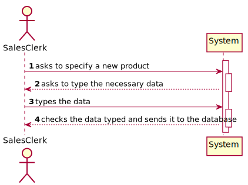
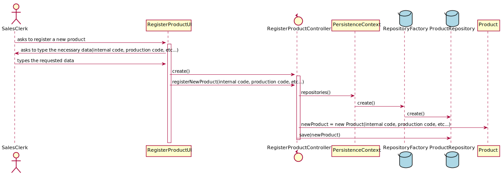
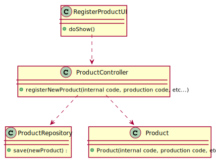

# US_1001
=======================================

# 1. Requisitos

**US_1001** As Sales Clerk, I want to specify a new product for sale.

A interpretação feita deste requisito foi no sentido de permitir o registo de um novo Product à base de dados, quem faz este registo é um Sales Clerk.

# 2. Análise

A qualquer momento, pode ser relevante o registo de um novo Product, por um Sales Clerk, à base de dados.

## 2.1. UCD - Use Case Diagram

## 2.2. SSD - System Sequence Diagram

# 3. Design

A forma encontrada para resolver este problema foi através do uso do padrão *Controller* para criar o controlador **ProductController**.
Este controlador é responsável pela organização e tratamento do processo de criação de um novo Product no sistema.
Este controlador usa a classe **Product** para criar uma instância de product.
Para persistir esta informação no sistema é usado o padrão *Repository*.
O controlador usa **ProductRepository** para guardar a informação na base de dados.

## 3.1. Realização da Funcionalidade

## 3.2. Diagrama de Classes

## 3.3. Padrões Aplicados

* Controller
* Repository

## 3.4. Testes 

**Teste 1:** Verificar que não é possível criar uma instância da classe Product com "internal code" nulo e mais de 24 carateres.

    @Test(expected = IllegalArgumentException.class)
    public void checkInternalCode() {
        System.out.println("checkInternalCode");

        //Tests if internal code is null
        List<Photo> list = new ArrayList<>();
        Photo p = new Photo("test.png");
        list.add(p);
        Product instance = new Product(null, "Test456", 123456688, "Test789", "TestABC", "TestDEF", "TestGHIINEEDMORECHARACTERS", "TestJKL", list, "TestMNO", 25, 30, new Location(1,2,3));

        //Tests if internal code has more than 24 characters
        Product instance2 = new Product("fdkjouauggahdfuigaeohuigadehgauigheraiua", "Test456", 123456688, "Test789", "TestABC", "TestDEF", "TestGHIINEEDMORECHARACTERS", "TestJKL", list, "TestMNO", 25, 30, new Location(1,2,3));
    }

**Teste 2:** Verificar que não é possível criar uma instância da classe Product com "production code" nulo e mais de 24 carateres.

    @Test(expected = IllegalArgumentException.class)
    public void checkProductionCode() {
        System.out.println("checkProductionCode");

        //Tests if production code is null
        List<Photo> list = new ArrayList<>();
        Photo p = new Photo("test.png");
        list.add(p);
        Product instance = new Product("Test123", null, 123456688, "Test789", "TestABC", "TestDEF", "TestGHIINEEDMORECHARACTERS", "TestJKL", list, "TestMNO", 25, 30, new Location(1,2,3));

        //Tests if production code has more than 24 characters
        Product instance2 = new Product("Test123", "Test456gerygrufhergiergertguhfdrgdrguh", 123456688, "Test789", "TestABC", "TestDEF", "TestGHIINEEDMORECHARACTERS", "TestJKL", list, "TestMNO", 25, 30, new Location(1,2,3));
    }

**Teste 3:** Verificar que não é possível criar uma instância da classe Product com "brand name" nulo e mais de 51 carateres.

    @Test(expected = IllegalArgumentException.class)
    public void checkBrandName() {
        System.out.println("checkBrandName");

        //Tests if brand name is null
        List<Photo> list = new ArrayList<>();
        Photo p = new Photo("test.png");
        list.add(p);
        Product instance = new Product("Test123", "Test456", 123456688, null, "TestABC", "TestDEF", "TestGHIINEEDMORECHARACTERS", "TestJKL", list, "TestMNO", 25, 30, new Location(1,2,3));

        //Tests if brand name has more than 51 characters
        Product instance2 = new Product("Test123", "Test456", 123456688, "Test789duhdfsuhfsdghrguhfsuihgfsuihdfgfdgfguhsfdtgeruhuhegfdfdjghsghjiksuhkj", "TestABC", "TestDEF", "TestGHIINEEDMORECHARACTERS", "TestJKL", list, "TestMNO", 25, 30, new Location(1,2,3));
    }

**Teste 4:** Verificar que não é possível criar uma instância da classe Product com "reference" nulo e mais de 24 carateres.

    @Test(expected = IllegalArgumentException.class)
    public void checkReference() {
        System.out.println("checkReference");
        //tests if reference is null
        List<Photo> list = new ArrayList<>();
        Photo p = new Photo("test.png");
        list.add(p);
        Product instance = new Product("Test123", "Test456", 123456688, "Test789", null, "TestDEF", "TestGHIINEEDMORECHARACTERS", "TestJKL", list, "TestMNO", 25, 30, new Location(1,2,3));

        //Tests if reference has more than 24 characters
        Product instance2 = new Product("Test123", "Test456", 123456688, "Test789", "TestABC53155131314141413414", "TestDEF", "TestGHIINEEDMORECHARACTERS", "TestJKL", list, "TestMNO", 25, 30, new Location(1,2,3));
    }

**Teste 5:** Verificar que não é possível criar uma instância da classe Product com "short description" nulo e mais de 31 carateres.

    @Test(expected = IllegalArgumentException.class)
    public void checkProductShortDescription() {
        System.out.println("checkProductShortDescription");

        //Tests if product short description is null
        List<Photo> list = new ArrayList<>();
        Photo p = new Photo("test.png");
        list.add(p);
        Product instance = new Product("Test123", "Test456", 123456688, "Test789", "TestABC", null, "TestGHIINEEDMORECHARACTERS", "TestJKL", list, "TestMNO", 25, 30, new Location(1,2,3));

        //Tests if product short description has more than 31 characters
        Product instance2 = new Product("Test123", "Test456", 123456688, "Test789", "TestABC", "TestDEFfdjghkalfdgjhkfdgjkbfjjjfjjjfuijj", "TestGHIINEEDMORECHARACTERS", "TestJKL", list, "TestMNO", 25, 30, new Location(1,2,3));
    }

**Teste 6:** Verificar que não é possível criar uma instância da classe Product com "extended description" nulo e entre 19 e 101 carateres.

    @Test(expected = IllegalArgumentException.class)
    public void checkProductExtendedDescription() {
        System.out.println("checkProductExtendedDescription");

        //Tests if product extended description is null
        List<Photo> list = new ArrayList<>();
        Photo p = new Photo("test.png");
        list.add(p);
        Product instance = new Product("Test123", "Test456", 123456688, "Test789", "TestABC", "TestDEF", null, "TestJKL", list, "TestMNO", 25, 30, new Location(1,2,3));

        //Tests if product extended description has more than 101 characters
        Product instance2 = new Product("Test123", "Test456", 123456688, "Test789", "TestABC", "TestDEF", "TestGHIsdrhisfygsygfsbyhifsdhiobfsdhisdgghfsdghhdgsdsfhiogjhkgsdfdfhouiofsdguuhfasfwrgysfwrghfwehjehjdeuiuiofsdguifgsd", "TestJKL", list, "TestMNO", 25, 30, new Location(1,2,3));

        //Tests if product extended description has less than 19 characters
        Product instance3 = new Product("Test123", "Test456", 123456688, "Test789", "TestABC", "TestDEF", "TestGHI", "TestJKL", list, "TestMNO", 25, 30, new Location(1,2,3));

    }

**Teste 5:** Verificar que não é possível criar uma instância da classe Product com "technical description" nulo.

    @Test(expected = IllegalArgumentException.class)
    public void checkProductTechicalDescription() {
        System.out.println("checkProductTechnicalDescription");

        //Tests if product technical description is null
        List<Photo> list = new ArrayList<>();
        Photo p = new Photo("test.png");
        list.add(p);
        Product instance = new Product("Test123", "Test456", 123456688, "Test789", "TestABC", "TestDEF", "TestGHIINEEDMORECHARACTERS", null, list, "TestMNO", 25, 30, new Location(1,2,3));

    }

**Teste 5:** Verificar que não é possível criar uma instância da classe Product com "photo path" errado.

    @Test(expected = IllegalArgumentException.class)
    public void checkPhotoPath() {
        System.out.println("checkPhotoPath");

        //Tests if photo path is wrong
        List<Photo> list = new ArrayList<>();
        Photo p = new Photo("test.omegalul");
        list.add(p);
        Product instance = new Product("Test123", "Test456", 123456688, "Test789", "TestABC", "TestDEF", "TestGHIINEEDMORECHARACTERS", "TestJKL", list, "TestMNO", 25, 30, new Location(1,2,3));

    }

# 4. Implementação

N/A

# 5. Integração/Demonstração

N/A

# 6. Observações

N/A

