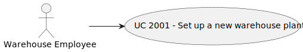
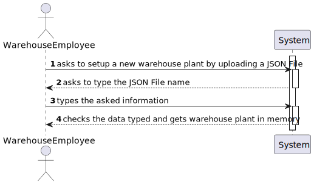
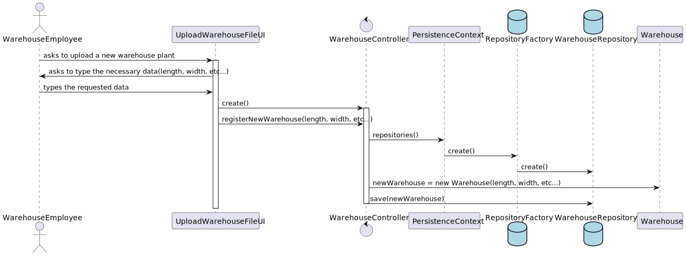
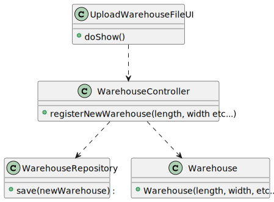

# US2001
=======================================

# 1. Requisitos

**US2001** As Warehouse Employee, I want to set up the warehouse plant by uploading a JSON file.

A interpretação feita deste requisito foi no sentido de permitir o registo de uma nova planta de warehouse à base de dados, quem faz este registo é um Warehouse Employee.

# 2. Análise

Informação relativa à planta da warehouse é disponibilizada através de JSON files.
Dar upload a uma warehouse plant involve dar upload a um JSON file personalizado descrevendo a warehouse
e todos as localizações de onde poderá ter produtos ou AGVs.le locations (of products and AGVs).

## 2.1. UCD - Use Case Diagram

## 2.2. SSD - System Sequence Diagram

# 3. Design

A forma encontrada para resolver este problema foi através do uso do padrão *Controller* para criar o controlador **WarehouseController**.
Este controlador é responsável pela organização e tratamento do processo de criação de um novo Warehouse no sistema.
Este controlador usa a classe **Warehouse** para criar uma instância de Warehouse.

The JSON structure is as follows:

• Warehouse: a textual description of the warehouse to which the information pertains.

• Length: a numeric value specifying the length of the warehouse.

• Width: a numeric value specifying the width of the warehouse.

• Square: a numeric value specifying the length/width of the smallest square relevant for the
warehouse.

• Unit: the metric unit (e.g.: centimeters, millimeters) in which the values of the Length, Width and
Square fields are expressed.

• Aisles: a list of the aisles existing in the warehouse. For each aisle, it is specified an identifier (Id),
three squares (named begin, end and depth respectively) to state/determine the aisle location,
the accessibility direction, and the aisle’ rows. Squares are identified by two coordinates: lsquare
and wsquare denoting the number of the square regarding length and width respectively. The
accessibility direction consists of two chars: the first char (either “w” or “l”) denotes that
accessibility is made varying the width or the length regarding the aisle; while the latter char
denotes if such variation is computed by incrementing (“+”) or decrementing (“-”) width/length.
Similarly, for each row, it is specified its identifier (Id) and the location of the row in the aisle is
given by two squares: begin and end.

• AVGDocks: a list of the AVG docks existing in the warehouse. Like aisles, a dock has an identified
(Id), a location determined by means of three squares (begin, end and depth) and its accessibility
direction.

## 3.1. Realização da Funcionalidade

## 3.2. Diagrama de Classes

## 3.3. Padrões Aplicados

* Controller
* Repository

## 3.4. Testes

**Teste 1:** Verificar se a variavel "length" é nula

    @Test(expected = IllegalArgumentException.class)
    public void testLength(){
        System.out.println("Length test");

        coordinates CoordinatesB = new coordinates(2,3);
        coordinates CoordinatesE = new coordinates(2,3);
        coordinates CoordinatesD = new coordinates(2,3);
        List<Rows> rowsList = new ArrayList<>();
        Rows rowExample = new Rows(1L,CoordinatesB,CoordinatesE,5L);
        rowsList.add(rowExample);
        Aisle aisle = new Aisle(1L,CoordinatesB,CoordinatesE,CoordinatesD,"-l",rowsList);
        List<Aisle> aisleList = new ArrayList<>();
        aisleList.add(aisle);
        AGVDOCK agvdock = new AGVDOCK("ab",CoordinatesB,CoordinatesE,CoordinatesD,"-m");
        List<AGVDOCK> agvdockList = new ArrayList<>();
        agvdockList.add(agvdock);

        Warehouse instanceWarehouse = new Warehouse(null,10L,10L,"cm",aisleList,agvdockList);

    }
**Teste 2:** Verificar se o campo "width" é nulo

        @Test(expected = IllegalArgumentException.class)
        public void testWidth(){
        System.out.println("Width test");

        coordinates CoordinatesB = new coordinates(2,3);
        coordinates CoordinatesE = new coordinates(2,3);
        coordinates CoordinatesD = new coordinates(2,3);
        List<Rows> rowsList = new ArrayList<>();
        Rows rowExample = new Rows(1L,CoordinatesB,CoordinatesE,5L);
        rowsList.add(rowExample);
        Aisle aisle = new Aisle(1L,CoordinatesB,CoordinatesE,CoordinatesD,"-l",rowsList);
        List<Aisle> aisleList = new ArrayList<>();
        aisleList.add(aisle);
        AGVDOCK agvdock = new AGVDOCK("ab",CoordinatesB,CoordinatesE,CoordinatesD,"-m");
        List<AGVDOCK> agvdockList = new ArrayList<>();
        agvdockList.add(agvdock);

        Warehouse instanceWarehouse = new Warehouse(10L,null,10L,"cm",aisleList,agvdockList);

    }

**Teste 3:** Verificar se o campo "square" é nulo

    @Test(expected = IllegalArgumentException.class)
    public void testSquare(){
        System.out.println("Square test");

        coordinates CoordinatesB = new coordinates(2,3);
        coordinates CoordinatesE = new coordinates(2,3);
        coordinates CoordinatesD = new coordinates(2,3);
        List<Rows> rowsList = new ArrayList<>();
        Rows rowExample = new Rows(1L,CoordinatesB,CoordinatesE,5L);
        rowsList.add(rowExample);
        Aisle aisle = new Aisle(1L,CoordinatesB,CoordinatesE,CoordinatesD,"-l",rowsList);
        List<Aisle> aisleList = new ArrayList<>();
        aisleList.add(aisle);
        AGVDOCK agvdock = new AGVDOCK("ab",CoordinatesB,CoordinatesE,CoordinatesD,"-m");
        List<AGVDOCK> agvdockList = new ArrayList<>();
        agvdockList.add(agvdock);

        Warehouse instanceWarehouse = new Warehouse(10L,10L,null,"cm",aisleList,agvdockList);

    }

**Teste 4:** Verificar se o campo "Unit" é vazio

        @Test(expected = IllegalArgumentException.class)
        public void testUnitEmpty(){
        System.out.println("Unit empty test");

        coordinates CoordinatesB = new coordinates(2,3);
        coordinates CoordinatesE = new coordinates(2,3);
        coordinates CoordinatesD = new coordinates(2,3);
        List<Rows> rowsList = new ArrayList<>();
        Rows rowExample = new Rows(1L,CoordinatesB,CoordinatesE,5L);
        rowsList.add(rowExample);
        Aisle aisle = new Aisle(1L,CoordinatesB,CoordinatesE,CoordinatesD,"-l",rowsList);
        List<Aisle> aisleList = new ArrayList<>();
        aisleList.add(aisle);
        AGVDOCK agvdock = new AGVDOCK("ab",CoordinatesB,CoordinatesE,CoordinatesD,"-m");
        List<AGVDOCK> agvdockList = new ArrayList<>();
        agvdockList.add(agvdock);

        Warehouse instanceWarehouse = new Warehouse(10L,10L,10L,"",aisleList,agvdockList);

    }

**Teste 5:** Verificar se o campo "unit" é nulo

        @Test(expected = IllegalArgumentException.class)
         public void testUnitNull(){
        System.out.println("Unit null test");

        coordinates CoordinatesB = new coordinates(2,3);
        coordinates CoordinatesE = new coordinates(2,3);
        coordinates CoordinatesD = new coordinates(2,3);
        List<Rows> rowsList = new ArrayList<>();
        Rows rowExample = new Rows(1L,CoordinatesB,CoordinatesE,5L);
        rowsList.add(rowExample);
        Aisle aisle = new Aisle(1L,CoordinatesB,CoordinatesE,CoordinatesD,"-l",rowsList);
        List<Aisle> aisleList = new ArrayList<>();
        aisleList.add(aisle);
        AGVDOCK agvdock = new AGVDOCK("ab",CoordinatesB,CoordinatesE,CoordinatesD,"-m");
        List<AGVDOCK> agvdockList = new ArrayList<>();
        agvdockList.add(agvdock);

        Warehouse instanceWarehouse = new Warehouse(10L,10L,10L,null,aisleList,agvdockList);

    }

**Teste 6:** Verificar se a lista de Aisles é nula

        @Test(expected = IllegalArgumentException.class)
        public void testAisleListNull(){
        System.out.println("Aisle list null test");

        coordinates CoordinatesB = new coordinates(2,3);
        coordinates CoordinatesE = new coordinates(2,3);
        coordinates CoordinatesD = new coordinates(2,3);
        List<Rows> rowsList = new ArrayList<>();
        Rows rowExample = new Rows(1L,CoordinatesB,CoordinatesE,5L);
        rowsList.add(rowExample);
        Aisle aisle = new Aisle(1L,CoordinatesB,CoordinatesE,CoordinatesD,"-l",rowsList);
        List<Aisle> aisleList = new ArrayList<>();
        aisleList.add(aisle);
        AGVDOCK agvdock = new AGVDOCK("ab",CoordinatesB,CoordinatesE,CoordinatesD,"-m");
        List<AGVDOCK> agvdockList = new ArrayList<>();
        agvdockList.add(agvdock);

        Warehouse instanceWarehouse = new Warehouse(10L,10L,10L,"cm",null,agvdockList);

    }

**Teste 7:** Verificar se a lista de Aisles é vazia

        @Test(expected = IllegalArgumentException.class)
        public void testAisleListEmpty(){
        System.out.println("Aisle list empty test");

        coordinates CoordinatesB = new coordinates(2,3);
        coordinates CoordinatesE = new coordinates(2,3);
        coordinates CoordinatesD = new coordinates(2,3);
        List<Rows> rowsList = new ArrayList<>();
        Rows rowExample = new Rows(1L,CoordinatesB,CoordinatesE,5L);
        rowsList.add(rowExample);
        List<Aisle> aisleList = new ArrayList<>();

        AGVDOCK agvdock = new AGVDOCK("ab",CoordinatesB,CoordinatesE,CoordinatesD,"-m");
        List<AGVDOCK> agvdockList = new ArrayList<>();
        agvdockList.add(agvdock);

        Warehouse instanceWarehouse = new Warehouse(10L,10L,10L,"cm",aisleList,agvdockList);

    }

**Teste 8:** Verificar se a lista de AGVDocks é nula

    @Test(expected = IllegalArgumentException.class)
    public void testAGVDockListNull(){
        System.out.println("AGVDock list null test");

        coordinates CoordinatesB = new coordinates(2,3);
        coordinates CoordinatesE = new coordinates(2,3);
        coordinates CoordinatesD = new coordinates(2,3);
        List<Rows> rowsList = new ArrayList<>();
        Rows rowExample = new Rows(1L,CoordinatesB,CoordinatesE,5L);
        rowsList.add(rowExample);
        Aisle aisle = new Aisle(1L,CoordinatesB,CoordinatesE,CoordinatesD,"-l",rowsList);
        List<Aisle> aisleList = new ArrayList<>();
        aisleList.add(aisle);
        AGVDOCK agvdock = new AGVDOCK("ab",CoordinatesB,CoordinatesE,CoordinatesD,"-m");
        List<AGVDOCK> agvdockList = new ArrayList<>();
        agvdockList.add(agvdock);

        Warehouse instanceWarehouse = new Warehouse(10L,10L,10L,"cm",aisleList,null);

    }

**Teste 9:** Verificar se a lista de AGVDocks é vazia

    @Test(expected = IllegalArgumentException.class)
    public void testAGVDockListEmpty(){
        System.out.println("AGVDock list empty test");

        coordinates CoordinatesB = new coordinates(2,3);
        coordinates CoordinatesE = new coordinates(2,3);
        coordinates CoordinatesD = new coordinates(2,3);
        List<Rows> rowsList = new ArrayList<>();
        Rows rowExample = new Rows(1L,CoordinatesB,CoordinatesE,5L);
        rowsList.add(rowExample);
        Aisle aisle = new Aisle(1L,CoordinatesB,CoordinatesE,CoordinatesD,"-l",rowsList);
        List<Aisle> aisleList = new ArrayList<>();
        aisleList.add(aisle);
        List<AGVDOCK> agvdockList = new ArrayList<>();

        Warehouse instanceWarehouse = new Warehouse(10L,10L,10L,"cm",aisleList,agvdockList);

    }

# 4. Implementação

*N/A*

# 5. Integração/Demonstração

*N/A*

# 6. Observações

*N/A*

