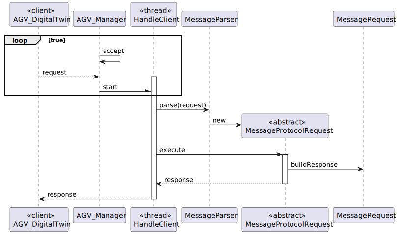

# US5002
=======================================

# 1. Requisitos

*US5002* As Project Manager, I want that the team start developing the output communication module of the AGV digital twin to update its status on the "AGVManager".
# 2. Análise

It must be used the provided application protocol (SPOMS2022).
It is suggested the adoptiong of concurrent mechanisms (e.g. threads) and state sharing between these mechanisms.
In this sprint, for demonstration purposes, it is acceptable to mock processing some incoming requests to foster some output communication.

# 3. Design

To do this issue, we created a client *DigitalTwinClient* and a server *AGVManagerServer* so that the communcation would be possible in the way it was asked for.

## 3.1. Realização da Funcionalidade

All we have to do to is to execute the server class *AGVManagerServer* proceeded by the client class *DigitalTwinClient*.

## 3.2. Diagrama de Classes

Sequence Diagram

# 4. Observações

We found this topic of communication between server client very confusing to start with, but we hope to be able to do all the issues related to it, the correct way.

