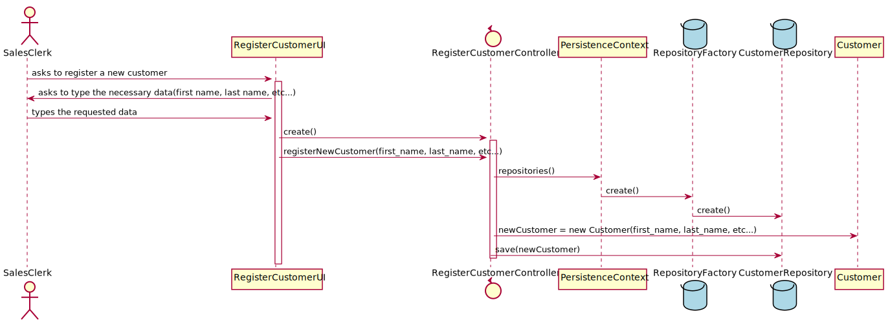

# US_1003
=======================================

# 1. Requisitos

**US_1003** As Sales Clerk, I want to register a new customer.

A interpretação feita deste requisito foi no sentido de permitir o registo de um novo Customer à base de dados, quem faz este registo é um Sales Clerk e não o próprio Customer.

# 2. Análise

A qualquer momento, pode ser relevante o registo de um novo Customer, por um Sales Clerk, à base de dados.

## 2.1. UCD - Use Case Diagram

## 2.2. SSD - System Sequence Diagram

# 3. Design

A forma encontrada para resolver este problema foi através do uso do padrão *Controller* para criar o controlador **RegisterCustomerController**. 
Este controlador é responsável pela organização e tratamento do processo de criação de um novo Customer no sistema. 
Este controlador usa a classe **Customer** para criar uma instância de customer. 
Para persistir esta informação no sistema é usado o padrão *Repository*. 
O controlador usa **CustomerRepository** para guardar a informação na base de dados.

## 3.1. Realização da Funcionalidade

## 3.2. Diagrama de Classes

## 3.3. Padrões Aplicados

* Controller
* Repository

## 3.4. Testes 

**Teste 1:** Verificar que não é possível criar uma instância da classe Customer com "first name" nulo e mais de 15 carateres.

    @Test(expected = IllegalArgumentException.class)
    public void checkFirstName() {
        System.out.println("checkFirstName");

        //Tests if first name is null
        Customer customer = new Customer(null, "Silva", "12345ABC", 987657443, Male, "antonio@gmail.com", new Birthday(2,12,1999), new Address("Rua das Coves", 23, "456-312", "Porto", "Portugal"));

        //Tests if first name has less than 16 characters
        Customer customer2 = new Customer("abcdefdfdsdfgdgdasdas", "Silva", "12345ABC", 987657443, Male, "antonio@gmail.com", new Birthday(2,12,1999), new Address("Rua das Coves", 23, "456-312", "Porto", "Portugal"));
    }

**Teste 2:** Verificar que não é possível criar uma instância da classe Customer com "last name" nulo e mais de 16 carateres.

    @Test(expected = IllegalArgumentException.class)
    public void checkLastName() {
        System.out.println("checkLastName");

        //Tests if last name is null
        Customer customer = new Customer("António", null, "12345ABC", 987657443, Male, "antonio@gmail.com", new Birthday(2,12,1999), new Address("Rua das Coves", 23, "456-312", "Porto", "Portugal"));

        //Tests if last name has less than 16 characters
        Customer customer2 = new Customer("António", "abcdefdfdsdfgdgdasdas", "12345ABC", 987657443, Male, "antonio@gmail.com", new Birthday(2,12,1999), new Address("Rua das Coves", 23, "456-312", "Porto", "Portugal"));
    }

**Teste 3:** Verificar que não é possível criar uma instância da classe Customer com "vatID" nulo e mais de 10 carateres.

    @Test(expected = IllegalArgumentException.class)
    public void checkVatID() {
        System.out.println("checkVatID");

        //Tests if vatID is null
        Customer customer = new Customer("António", "Silva", null, 987657443, Male, "antonio@gmail.com", new Birthday(2,12,1999), new Address("Rua das Coves", 23, "456-312", "Porto", "Portugal"));

        //Tests if vatID has less than 10 characters
        Customer customer2 = new Customer("António", "Silva", "123456789ABC", 987657443, Male, "antonio@gmail.com", new Birthday(2,12,1999), new Address("Rua das Coves", 23, "456-312", "Porto", "Portugal"));
    }

**Teste 4:** Verificar que não é possível criar uma instância da classe Customer com "phone number" nulo e diferente de 9 dígitos.

    @Test(expected = IllegalArgumentException.class)
    public void checkPhoneNumber() {
        System.out.println("checkPhoneNumber");

        //Tests if phone number is null
        Customer customer = new Customer("António", "Silva", "12345ABC", 0, Male, "antonio@gmail.com", new Birthday(2,12,1999), new Address("Rua das Coves", 23, "456-312", "Porto", "Portugal"));

        //Tests if phone number is != than 9 digits
        Customer customer2 = new Customer("António", "Silva", "12345ABC", 957443, Male, "antonio@gmail.com", new Birthday(2,12,1999), new Address("Rua das Coves", 23, "456-312", "Porto", "Portugal"));
    }

**Teste 5:** Verificar que não é possível criar uma instância da classe Customer com "gender" nulo e diferente de Male e Female.

    @Test(expected = IllegalArgumentException.class)
    public void checkGender() {
        System.out.println("checkGender");

        //Tests if gender is null
        Customer customer = new Customer("António", "Silva", "12345ABC", 987657443, null, "antonio@gmail.com", new Birthday(2,12,1999), new Address("Rua das Coves", 23, "456-312", "Porto", "Portugal"));

        //Tests if gender is != than Male or Female
        Customer customer2 = new Customer("António", "Silva", "12345ABC", 987657443, Gender.valueOf("abc"), "antonio@gmail.com", new Birthday(2,12,1999), new Address("Rua das Coves", 23, "456-312", "Porto", "Portugal"));
    }

**Teste 6:** Verificar que não é possível criar uma instância da classe Customer com "email" nulo e mais de 41 carateres.

    @Test(expected = IllegalArgumentException.class)
    public void checkEmail() {
        System.out.println("checkEmail");

        //Tests if email is null
        Customer customer = new Customer("António", "Silva", "12345ABC", 987657443, Male, null, new Birthday(2,12,1999), new Address("Rua das Coves", 23, "456-312", "Porto", "Portugal"));

        //Tests if email has less than 41 digits
        Customer customer2 = new Customer("António", "Silva", "12345ABC", 987657443, Male, "ansudjfgfgdfrgtdfdfdsdfgrgrdtonio@gmail.com", new Birthday(2,12,1999), new Address("Rua das Coves", 23, "456-312", "Porto", "Portugal"));
    }

**Teste 7:** Verificar que não é possível criar uma instância da classe Customer com "birthday" nulo, "birthday day" maior que 32 e "birthday month" maior que 13.

    @Test(expected = IllegalArgumentException.class)
    public void checkBirthday() {
        System.out.println("checkBirthday");

        //Tests if birthday is null
        Customer customer = new Customer("António", "Silva", "12345ABC", 987657443, Male, "antonio@gmail.com", new Birthday(0,0,0), new Address("Rua das Coves", 23, "456-312", "Porto", "Portugal"));

        //Tests if birthday day is less than 32
        Customer customer2 = new Customer("António", "Silva", "12345ABC", 987657443, Male, "antonio@gmail.com", new Birthday(45,12,1999), new Address("Rua das Coves", 23, "456-312", "Porto", "Portugal"));

        //Tests if birthday month is less than 13
        Customer customer3 = new Customer("António", "Silva", "12345ABC", 987657443, Male, "antonio@gmail.com", new Birthday(2,17,1999), new Address("Rua das Coves", 23, "456-312", "Porto", "Portugal"));
    }

**Teste 8:** Verificar que não é possível criar uma instância da classe Customer com "address" nulo e com "address name" mais de 31 carateres.

    @Test(expected = IllegalArgumentException.class)
    public void checkAddress() {
        System.out.println("checkAddress");

        //Tests if address is null
        Customer customer = new Customer("António", "Silva", "12345ABC", 987657443, Male, "antonio@gmail.com", new Birthday(2,12,1999), new Address("", 0, null, null, null));

        //Tests if address name has less than 31 characters
        Customer customer2 = new Customer("António", "Silva", "12345ABC", 987657443, Male, "antonio@gmail.com", new Birthday(2,12,1999), new Address("Rua das Coves sdsaseds dsd erereds sdasdefefe", 23, "456-312", "Porto", "Portugal"));
    }

# 4. Implementação

*N/A*

# 5. Integração/Demonstração

*N/A*

# 6. Observações

*N/A*

