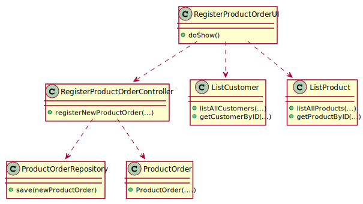

# US_1003
=======================================

# 1. Requisitos

**US_1004** As Sales Clerk, I want to create a new products order on behalf of a given customer.

A interpretação feita deste requisito foi no sentido de permitir o registo de uma nova Product Order à base de dados, quem faz este registo é um Sales Clerk.

# 2. Análise

A qualquer momento, pode ser relevante o registo de uma nova Product Order, por um Sales Clerk, à base de dados.

## 2.1. UCD - Use Case Diagram

## 2.2. SSD - System Sequence Diagram

# 3. Design

A forma encontrada para resolver este problema foi através do uso do padrão *Controller* para criar o controlador **RegisterProductOrderController**. 
Este controlador é responsável pela organização e tratamento do processo de criação de uma nova Product Order no sistema. 
Este controlador usa a classe **Product Order** para criar uma instância de product order. 
Para persistir esta informação no sistema é usado o padrão *Repository*. 
O controlador usa **ProductOrderRepository** para guardar a informação na base de dados.

## 3.1. Realização da Funcionalidade

## 3.2. Diagrama de Classes

## 3.3. Padrões Aplicados

* Controller
* Repository

## 3.4. Testes 

**Teste 1:** Verificar que não é possível criar uma instância da classe ProductOrder com "ProductOrderStatus" nulo.

    @Test(expected = IllegalArgumentException.class)
    public void checkProductOrderStatus() {
        System.out.println("checkProductOrderStatus");

        //Tests if ProductOrderStatus is null
        ProductOrder productOrder = ProductOrderTest();
        productOrder.setProductOrderStatus(null);
    }

**Teste 2:** Verificar que não é possível criar uma instância da classe ProductOrder com "Shipment_method" nulo e diferente de Standard, Blue ou Green.

    @Test(expected = IllegalArgumentException.class)
    public void checkShipment_method() {
        System.out.println("checkShipment_method");

        //Tests if Shipment_method is null
        ProductOrder productOrder = ProductOrderTest();
        productOrder.setShipment_method(null);

        //Tests if Shipment_method is different from Standard or Blue or Green
        productOrder.setShipment_method("teste");
    }

**Teste 3:** Verificar que não é possível criar uma instância da classe ProductOrder com "Payment_method" nulo e diferente de Paypal ou Visa.

    @Test(expected = IllegalArgumentException.class)
    public void checkPayment_method() {
        System.out.println("checkPayment_method");

        //Tests if Payment_method is null
        ProductOrder productOrder = ProductOrderTest();
        productOrder.setPayment_method(null);

        //Tests if Payment_method is different from PayPal or Visa
        productOrder.setPayment_method("teste");
    }

**Teste 4:** Verificar que não é possível criar uma instância da classe ProductOrder com "Datetime" nulo.

    @Test(expected = IllegalArgumentException.class)
    public void checkDatetime() {
        System.out.println("checkDatetime");

        //Tests if Datetime is null
        ProductOrder productOrder = ProductOrderTest();
        productOrder.setDatetime(null);
    }

**Teste 5:** Verificar que não é possível criar uma instância da classe ProductOrder com "Customer" nulo.

    @Test(expected = IllegalArgumentException.class)
    public void checkCustomer() {
        System.out.println("checkCustomer");

        //Tests if Customer is null
        ProductOrder productOrder = ProductOrderTest();
        productOrder.setCustomer(null);
    }

**Teste 6:** Verificar que não é possível criar uma instância da classe ProductOrder com "Line" nulo.

    @Test(expected = IllegalArgumentException.class)
    public void checkLine() {
        System.out.println("checkLine");

        //Tests if Line is null
        ProductOrder productOrder = ProductOrderTest();
        productOrder.setLine(null);
    }

**Teste 7:** Verificar que não é possível criar uma instância da classe ProductOrder com "Total_amount_before_taxes" nulo ou negativo.

    @Test(expected = IllegalArgumentException.class)
    public void checkTotal_amount_before_taxes() {
        System.out.println("checkTotal_amount_before_taxes");

        //Tests if total_amount_before_taxes is null
        ProductOrder productOrder = ProductOrderTest();
        productOrder.setTotal_amount_before_taxes(0);

        //Tests if total_amount_before_taxes is negative
        productOrder.setTotal_amount_before_taxes(-2);
    }

**Teste 8:** Verificar que não é possível criar uma instância da classe ProductOrder com "Total_amount_after_taxes" nulo ou negativo.

    @Test(expected = IllegalArgumentException.class)
    public void checkTotal_amount_after_taxes() {
        System.out.println("checkTotal_amount_after_taxes");

        //Tests if total_amount_after_taxes is null
        ProductOrder productOrder = ProductOrderTest();
        productOrder.setTotal_amount_after_taxes(0);

        //Tests if total_amount_after_taxes is negative
        productOrder.setTotal_amount_after_taxes(-2);
    }

# 4. Implementação

*N/A*

# 5. Integração/Demonstração

*N/A*

# 6. Observações

*N/A*

