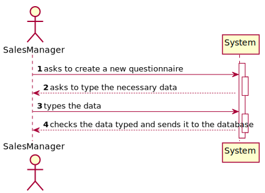
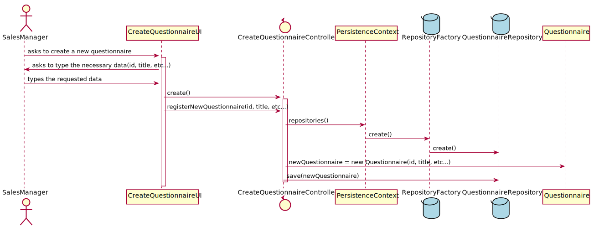
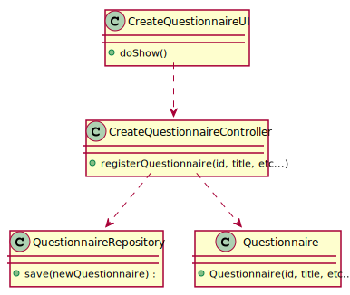

# US_1003
=======================================

# 1. Requisitos

**US_3001** As Sales Manager, I want to create a new questionnaire to be further answered by customers meeting the specified criteria (e.g.: have ordered a given product; belong to a given age group).

A interpretação feita deste requisito foi no sentido de permitir a criação de um novo Questionnaire à base de dados, quem faz este registo é um Sales Manager.

# 2. Análise

A qualquer momento, pode ser relevante a criação de um novo Questionnaire, por um Sales SalesManager, à base de dados.

## 2.1. UCD - Use Case Diagram

## 2.2. SSD - System Sequence Diagram

# 3. Design

A forma encontrada para resolver este problema foi através do uso do padrão *Controller* para criar o controlador **CreateQuestionnaireController**. 
Este controlador é responsável pela organização e tratamento do processo de criação de um novo Questionnaire no sistema. 
Este controlador usa a classe **Questionnaire** para criar uma instância de questionnaire. 
Para persistir esta informação no sistema é usado o padrão *Repository*. 
O controlador usa **QuestionnaireRepository** para guardar a informação na base de dados.

## 3.1. Realização da Funcionalidade

## 3.2. Diagrama de Classes

## 3.3. Padrões Aplicados

* Controller
* Repository

## 3.4. Testes 

**Teste 1:** Verificar que não é possível criar uma instância da classe Questionnaire com "Id" nulo.

    @Test(expected = AssertionError.class)
    public void checkIdNotNull() {
        System.out.println("checkIdNotNull");

        //Tests if Id is null
        List<String> options = new ArrayList<>();
        options.add("Option 1");

        List<Question> content = new ArrayList<>();
        content.add(new Question(1,"question","instruction",FREE_TEXT,MANDATORY,"condition",options));

        List<Section> sections = new ArrayList<>();
        sections.add(new Section(1,"Section Title","Section_description",MANDATORY,"Condition","Repeatability",content));

       Questionnaire questionnaire = new Questionnaire(null, "Title", "Welcome Message", sections, "Final Message",3);
    }

**Teste 2:** Verificar que não é possível criar uma instância da classe Questionnaire com "Id" mais de 15 carateres.

    @Test(expected = AssertionError.class)
    public void checkIdNotMoreThan15() {
        System.out.println("checkIdNotMoreThan15");

        //Tests if Id has more than 15 characters
        List<String> options = new ArrayList<>();
        options.add("Option 1");

        List<Question> content = new ArrayList<>();
        content.add(new Question(1,"question","instruction",FREE_TEXT,MANDATORY,"condition",options));

        List<Section> sections = new ArrayList<>();
        sections.add(new Section(1,"Section Title","Section_description",MANDATORY,"Condition","Repeatability",content));

        Questionnaire questionnaire = new Questionnaire("1234567890ABCDEFSAS", "Title", "Welcome Message", sections, "Final Message",3);
    }

**Teste 3:** Verificar que não é possível criar uma instância da classe Questionnaire com "Title" nulo.

    @Test(expected = AssertionError.class)
    public void checkTitleNotNull() {
        System.out.println("checkTitleNotNull");

        //Tests if Title is null
        List<String> options = new ArrayList<>();
        options.add("Option 1");

        List<Question> content = new ArrayList<>();
        content.add(new Question(1,"question","instruction",FREE_TEXT,MANDATORY,"condition",options));

        List<Section> sections = new ArrayList<>();
        sections.add(new Section(1,"Section Title","Section_description",MANDATORY,"Condition","Repeatability",content));

        Questionnaire questionnaire = new Questionnaire("123ABC", null, "Welcome Message", sections, "Final Message",3);
    }
**Teste 4:** Verificar que não é possível criar uma instância da classe Questionnaire com "Title" mais de 20 carateres.

    @Test(expected = AssertionError.class)
    public void checkTitleNotMoreThan20() {
        System.out.println("checkTitleNotMoreThan20");

        //Tests if Title has more than 20 characters
        List<String> options = new ArrayList<>();
        options.add("Option 1");

        List<Question> content = new ArrayList<>();
        content.add(new Question(1,"question","instruction",FREE_TEXT,MANDATORY,"condition",options));

        List<Section> sections = new ArrayList<>();
        sections.add(new Section(1,"Section Title","Section_description",MANDATORY,"Condition","Repeatability",content));

        Questionnaire questionnaire = new Questionnaire("123ABC", "1234567890ABCasdasdasdDEFSAS", "Welcome Message", sections, "Final Message",3);
    }

**Teste 5:** Verificar que não é possível criar uma instância da classe Questionnaire com "FinalMessage" nulo.

    @Test(expected = AssertionError.class)
    public void checkFinalMessageNotNull() {
        System.out.println("checkFinalMessageNotNull");

        //Tests if FinalMessage is null
        List<String> options = new ArrayList<>();
        options.add("Option 1");

        List<Question> content = new ArrayList<>();
        content.add(new Question(1,"question","instruction",FREE_TEXT,MANDATORY,"condition",options));

        List<Section> sections = new ArrayList<>();
        sections.add(new Section(1,"Section Title","Section_description",MANDATORY,"Condition","Repeatability",content));

        Questionnaire questionnaire = new Questionnaire("123ABC", "asfcasfdas", "Welcome Message", sections, null,3);
    }

**Teste 6:** Verificar que não é possível criar uma instância da classe Questionnaire com "FinalMessage" mais de 30 carateres.

    @Test(expected = AssertionError.class)
    public void checkFinalMessageNotMoreThan30() {
        System.out.println("checkFinalMessageNotMoreThan30");

        //Tests if FinalMessage has more than 30 characters
        List<String> options = new ArrayList<>();
        options.add("Option 1");

        List<Question> content = new ArrayList<>();
        content.add(new Question(1,"question","instruction",FREE_TEXT,MANDATORY,"condition",options));

        List<Section> sections = new ArrayList<>();
        sections.add(new Section(1,"Section Title","Section_description",MANDATORY,"Condition","Repeatability",content));

        Questionnaire questionnaire = new Questionnaire("123ABC", "asfcasfdas", "Welcome Message", sections, "1234567890AASFDASDASD1234213BCDEFSAS",3);
    }

**Teste 7:** Verificar que não é possível criar uma instância da classe Questionnaire com "Number_of_days_it_will_be_performed" nulo.

    @Test(expected = AssertionError.class)
    public void checkNumber_of_days_it_will_be_performedNotNull() {
        System.out.println("checkNumber_of_days_it_will_be_performedNotNull");

        //Tests if Number_of_days_it_will_be_performed is null
        List<String> options = new ArrayList<>();
        options.add("Option 1");

        List<Question> content = new ArrayList<>();
        content.add(new Question(1,"question","instruction",FREE_TEXT,MANDATORY,"condition",options));

        List<Section> sections = new ArrayList<>();
        sections.add(new Section(1,"Section Title","Section_description",MANDATORY,"Condition","Repeatability",content));

        Questionnaire questionnaire = new Questionnaire("123ABC", "asfcasfdas", "Welcome Message", sections, "sgdtyyj",0);
    }

**Teste 8:** Verificar que não é possível criar uma instância da classe Questionnaire com "Number_of_days_it_will_be_performed" negativo.

    @Test(expected = AssertionError.class)
    public void checkNumber_of_days_it_will_be_performedNotNegative() {
        System.out.println("checkNumber_of_days_it_will_be_performedNotNegative");

        //Tests if Number_of_days_it_will_be_performed is negative
        List<String> options = new ArrayList<>();
        options.add("Option 1");

        List<Question> content = new ArrayList<>();
        content.add(new Question(1,"question","instruction",FREE_TEXT,MANDATORY,"condition",options));

        List<Section> sections = new ArrayList<>();
        sections.add(new Section(1,"Section Title","Section_description",MANDATORY,"Condition","Repeatability",content));

        Questionnaire questionnaire = new Questionnaire("123ABC", "asfcasfdas", "Welcome Message", sections, "sgdtyyj",-2);
    }

# 4. Implementação

*N/A*

# 5. Integração/Demonstração

*N/A*

# 6. Observações

*N/A*

